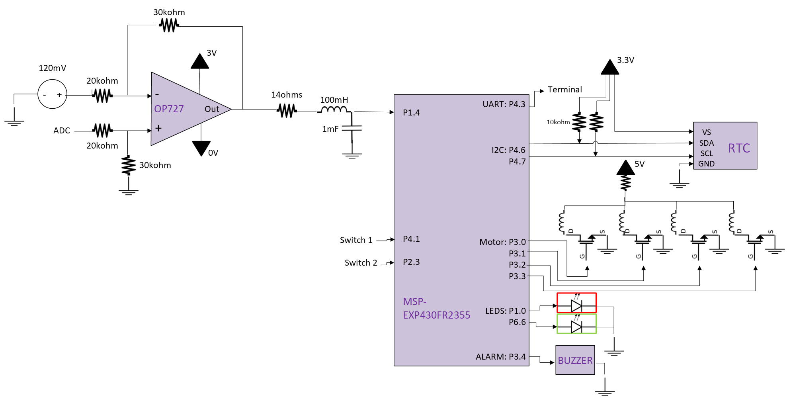

# Drill Press Control

## Project Description
**Drill Press Control** is an embedded systems project designed to interface a stepper motor with a microcontroller (MSP430). The system provides motor actuation, pressure monitoring, real-time clock (RTC) logging, and UART-based user reporting. Signal conditioning and safety features ensure precision and reliability.

📁 **Main Program**: [`FinalProject9main.c`](FinalProject9main.c)

---

## Development

### Part 1: Planning and Design
- Created a flowchart and pinout diagram to define program flow and hardware configuration.  
  

### Part 2: ADC Sensor Code
- Read simulated pressure data using the MSP430's ADC module.
- Implemented logic to trigger events when pressure thresholds are crossed.  
  

### Part 3: I2C RTC Code
- Communicated with a real-time clock module via I2C.
- Logged timestamps on button presses.  
  

### Part 4: UART Code
- Used UART to display real-time system messages.
- Included sensor data, motor activity, and time information.  
  

### Part 5: LED Timing Code
- Used LEDs to simulate the stepper motor pulses visually.  
  

### Part 6: Full Integration with Stepper Motor
- Combined all previous code modules.
- Added stepper motor control logic and final integration.  
  

### Part 7: Additional Functionality (Final Implementation)

📁 **Final Code**: [`FinalProject9main.c`](FinalProject9main.c)

- **ISR Optimization**: Kept interrupt service routines short. Used flags to defer logic to the main loop.
- **Rolling Average for ADC**:
  - Initial method used an O(n) loop, which caused performance issues.
  - Optimized using a circular buffer for O(1) averaging.
- **Pressure Safety Threshold**:
  - 50 lb threshold disables forward motor control.
  - Triggers a buzzer and sends a UART warning.
- **Enhanced ADC Signal Conditioning**:
  - **Zener diode** clipping to cap voltage at 3V.
  - **Difference amplifier** to remove 120 mV offset.
  - **Non-inverting amplifier** (gain = 1.5) to better utilize the ADC range.

---

## Getting Started

### Prerequisites
- MSP-EXP430FR2355 Development Board  
- Variable Power Supply  
- Stepper Motor (speed may vary based on gearing)  
- Analog Discovery 2 (optional, for signal simulation)  
- IDE with MSP430 support (e.g., Code Composer Studio)

### Installation & Usage
1. Download `FinalProject9main.c`.
2. Connect hardware based on the following pinout:  
   
3. Open the code in your IDE and adjust timing/threshold values if needed.
4. Build and flash the code to the MSP430 board.
5. Use UART to monitor system output and interact using buttons and analog inputs.

---

## Acknowledgments
- **Instructor**: Cory Mettler  
- **Course**: EELE 371: *Microprocessors: HW and SW*, Montana State University – Bozeman  
- **Platform**: MSP-EXP430FR2355  
- **Language**: C (compiled with Code Composer Studio)  
- **Resources**:
  - *Embedded Systems Design* by Brock LaMeres  
  - Diagrams created in Microsoft Visio
